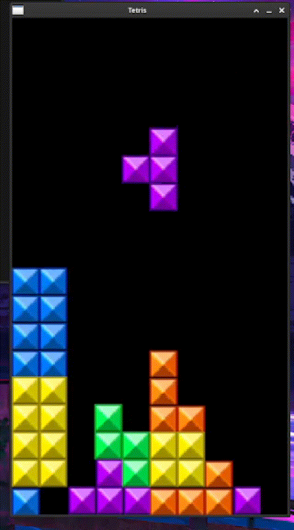

# Tetris
# Tetris in C++ / SDL2

A from-scratch Tetris clone written in C++ using SDL2 for windowing, input, and rendering. The game runs on a 10x18 grid, supports all seven tetrominoes with rotation, clears full rows, and scales fall speed and scoring by a difficulty level you pick at startup.

I built this to get more comfortable with C++ outside of coursework: managing resources safely, structuring game state, and working with a real-time loop instead of a console program.



## Features

- All 7 tetrominoes, each with its own rotation states
- 4 difficulty levels (faster drops and higher score per line)
- Line clearing with the stack shifting down
- Sprite-based rendering from a single sprite sheet
- Game ends when the stack reaches the top; final score prints to the console

## Controls

| Key | Action |
|-----|--------|
| Left / Right | Move piece |
| Down | Soft drop |
| Up | Rotate |

## Building and Running

**Requirements:** a C++11 (or newer) compiler, SDL2, and SDL2_image.

On Debian/Ubuntu:

```bash
sudo apt install g++ libsdl2-dev libsdl2-image-dev
```

On macOS (Homebrew):

```bash
brew install sdl2 sdl2_image
```

Compile and run from the repo root (the game loads `assets/tetrissprites.png` using a relative path, so run it from the directory that contains `assets/`):

```bash
g++ -std=c++17 tetris.cpp -o tetris $(sdl2-config --cflags --libs) -lSDL2_image
./tetris
```

You'll be prompted in the terminal to choose a level from 1 to 4, then the game window opens.

## How It Works

**Piece data is table-driven.** Each tetromino is described by a set of small 2D matrices, one per rotation state, along with its bounding dimensions and the region of the sprite sheet it's drawn from. Adding or changing a piece means editing data rather than writing new logic.

**Two representations of the board.** The playfield is an `int[18][10]` grid that stores which piece type occupies each cell (0 for empty). This is what collision checks and line clears operate on. Rendering reads from that same grid and draws each filled cell from the sprite sheet.

**Collision by edge cells.** Rather than testing every cell of a piece, the game finds the cells on the relevant edge (bottom, or right side for horizontal movement) and checks only those against the grid and the board boundaries. When a piece lands, it's written into the grid and a new random piece spawns at the top.

**Line clearing.** After a piece locks, each row is checked. A full row is removed by copying everything above it down one row, and the score increases by `100 * level` per cleared line.

**Timing.** A gravity timer based on `SDL_GetTicks()` moves the piece down every `1000 / level` milliseconds, independent of how fast the loop itself runs.

**Resource management.** SDL windows, renderers, surfaces, and textures are wrapped in `std::unique_ptr` with the matching SDL destroy function as a custom deleter, so cleanup happens automatically.

## Known Limitations and Next Steps

This is a working prototype, and there are things I know I'd improve:

- Rotation doesn't check for collisions, so a piece can rotate into the wall or into placed blocks
- Left-movement collision only checks the bottom row of the piece, so it's less accurate than the right-movement check
- No "next piece" preview, pause, hold, or on-screen score display (score is printed to the console at game over)
- Pieces are chosen with `rand()` rather than a 7-bag, so long droughts of a piece are possible
- Everything lives in `main()`; the next step would be splitting it into `Board`, `Piece`, and `Renderer` pieces to make the logic testable

## Tech

- C++
- SDL2
- SDL2_image

## Project Structure

```
.
├── tetris.cpp
└── assets/
    └── tetrissprites.png
```
